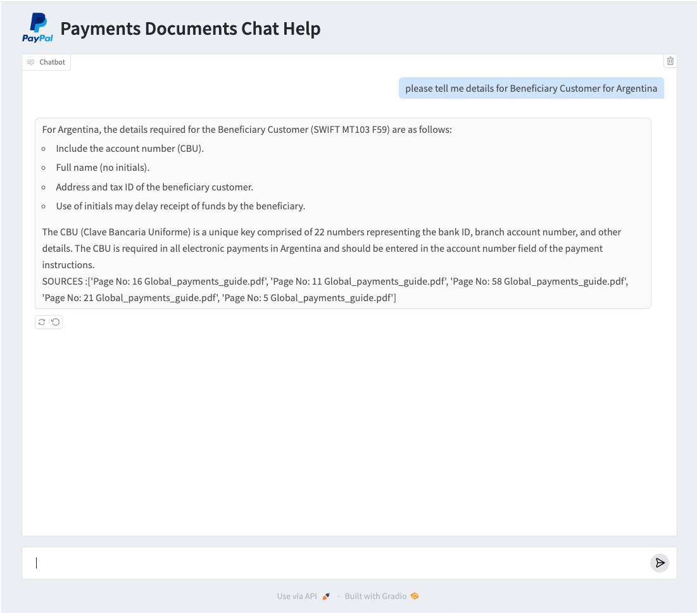
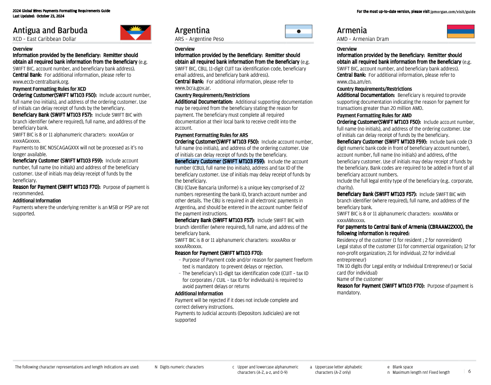

# Rag_Gradio_Chatbot_Pdf
<h1>Retrieval-Augmented Generation (RAG) Chatbot</h1>

  
  

This project demonstrates the implementation of a Retrieval-Augmented Generation (RAG) model using <strong>LangChain</strong> and <strong>OpenAI embeddings</strong>. The pipeline involves creating a vector store, building a RAG chain, and deploying the chatbot as a <strong>Gradio</strong> application with CSS customization.

 <b> Additionally we display the Sources of Documents in each response </b> 

<h2>Technical Overview</h2>

<h3>1. Vector Store Creation</h3>
<ul>
  <li>PDF documents are loaded using <code>PyPDFLoader</code> from <code>langchain_community.document_loaders</code>.</li>
  <li>Text embeddings are generated using <code>OpenAIEmbeddings</code> from <code>langchain_community.embeddings</code>.</li>
  <li>A <code>FAISS</code> vector store is constructed to enable efficient similarity-based retrieval.</li>
</ul>

<h3>2. Retrieval-Augmented Generation (RAG) Chain</h3>
<ul>
  <li>The <code>RetrievalQA</code> chain is configured with:
    <ul>
      <li>A ChatGPT-4 (or similar) model via <code>ChatOpenAI</code>.</li>
      <li>The FAISS vector store as the document retriever.</li>
    </ul>
  </li>
  <li>Combines retrieval with generative capabilities to provide context-aware responses.</li>
</ul>

<h3>3. Gradio Chatbot Application</h3>
<ul>
  <li>The chatbot interface is built using <code>Gradio</code>, providing an intuitive frontend for user interaction.</li>
  <li>CSS is used to customize the chat area height, font styles, and add a logo beside the title for branding.</li>
</ul>

<h2>Project Structure</h2>
<pre>
Langchain_model_vectorstore.py    # Script for vector store and RAG model setup
Gradio_chatbot.py                 # Script for Gradio chatbot deployment
assets/                           # Directory for CSS and additional resources
</pre>

<h2>Getting Started</h2>
<ol>
  <li>Clone the repository:
    <pre>git clone https://github.com/your-username/your-repo.git</pre>
  </li>
  <li>Install dependencies:
    <pre>pip install -r requirements_gradio.txt</pre>
  </li>
  <li>Run the application:
    <pre>python Gradio_chatbot.py</pre>
  </li>
</ol>

<h2>Example Usage</h2>

Ask domain-specific questions such as:

<ul>
  <li><em>"What are the payment guidelines in the document?"</em></li>
  <li><em>"Explain section 3 of the policy."</em></li>
</ul>

<h2>Customization</h2>
<ul>
  <li>Update <code>style.css</code> to modify the UI.</li>
  <li>Replace the logo image in the <code>assets/</code> folder.</li>
</ul>

<h2>Acknowledgments</h2>

This project utilizes <strong>LangChain</strong> for seamless integration of embeddings and vector stores, and <strong>Gradio</strong> for rapid UI deployment.

